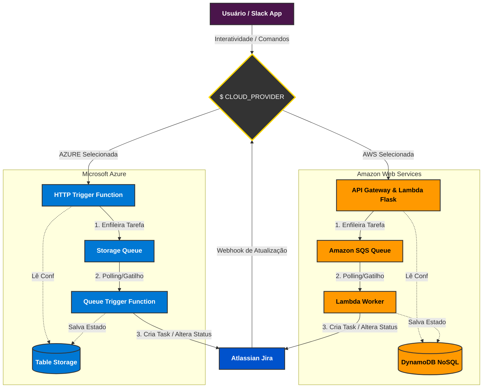

# 🤖 Jira-Slack Multi-Cloud Serverless Bot

Bem-vindo ao repositório do **Jira-Slack Bot Agnostic**, uma solução robusta, completamente assíncrona e orientada a eventos construída para o Trabalho de Conclusão de Curso (TCC). Este bot facilita e automatiza a comunicação e as jornadas de trabalho entre o ecossistema do **Slack** e o **Atlassian Jira**, garantindo escalabilidade, baixo custo e resiliência.

## 🚀 Arquitetura Multi-Cloud
Um dos principais diferenciais deste projeto é sua natureza **Agnostic Cloud**. O código-fonte foi projetado para rodar nativamente como **Funções Serverless** tanto na **Amazon Web Services (AWS)** quanto na **Microsoft Azure**.



### 🌟 Vantagens da Abordagem Multi-Cloud (Benefícios de Negócio)
Adotar este padrão *Agnostic* não é apenas uma escolha técnica, mas uma forte proteção corporativa para sistemas essenciais de operação de times:
- **Prevenção de Vendor Lock-in:** O núcleo da aplicação (Framework, Integrações Jira/Slack) não está acorrentado aos métodos proprietários de uma única empresa. 
- **Alta Disponibilidade e Disaster Recovery:** Se a AWS enfrentar um apagão em *us-east-1*, os times não perdem a habilidade de abrir chamados emergenciais; basta subir a rota da Azure instantaneamente.
- **Estratégia FinOps:** Permite que a empresa balanceie ou migre o fluxo de mensagens para a nuvem que estiver oferecendo o melhor "Free Tier" ou preço de mensageria no mês ou trimestre.
- **Durabilidade do Código de Negócio:** Se novas nuvens (ex: Google Cloud Platform) precisarem ser suportadas, apenas a camada rasa de *Adapters* precisará de implementações novas, não exigindo reescrever os fluxos do Chatbot.

A decisão de qual nuvem acionará o código atual e processará a fila de mensagens é ditada pela simples troca da variável de ambiente `CLOUD_PROVIDER` nos servidores. O framework interno aplica injeção de dependências para acionar a ferramenta nativa adequada:
- **AWS (`CLOUD_PROVIDER=AWS`)**: Roda sobre o API Gateway com AWS Lambda e AWS SQS. Os estados e diretórios são salvos no AWS DynamoDB.
- **Azure (`CLOUD_PROVIDER=AZURE`)**: Roda sobre o Azure App Services (Linux Consumption Plan) com Azure Storage Queues. O banco de dados é roteado para o Azure Table Storage.

## 🏗️ Estrutura e Padrões
O projeto adota uma **Arquitetura Desacoplada (Decoupled)** separada em dua camadas principais para evitar Timeouts no Slack (que exige respostas em até 3 segundos) e lidar com os "frios" eventuais do Jira.

1. **Frontend / HTTP Layer (API):**
   - Construída sobre Flask e a biblioteca `Slack Bolt`. 
   - Age como receiver dos botões de interatividade e atalhos (`/criar-chamado`) do Slack.
   - Transfere instantaneamente as execuções "pesadas" para a Fila de Mensagens local da Nuvem.
   - Fornece um simpático Dashboard em HTML no `/config` para vinculação visual e imediata de Canais do Slack vs. Chaves de Projetos no Jira.

2. **Backend / Worker Layer:**
   - Consome continuamente a Fila SQS (AWS) ou Queue Storage (Azure) absorvendo o pico de requisições.
   - Executa transições reais nos tickets utilizando as credenciais sensíveis e a API oficial do Jira (via pacote `jira`).
   
3. **Armazenamento e Estado (Databases & Queues):**
   - O projeto provisiona e utiliza automaticamente as seguintes estruturas gerenciadas na Nuvem para persistência de dados:
     * **Tabela `ChannelConfigs`**: Salva os formulários do painel Web (Relacionamento: Qual canal do Slack pode criar cards em qual Quadro/Projeto do Jira). Mapeado no **AWS DynamoDB** ou **Azure Table Storage**.
     * **Tabela `TicketLinks`**: Tabela de Memória Secundária. Registra de qual *Thread (Message_ts)* do Slack originou a criação de um Chamado. Utilizado pelo webhook do Jira para responder exatamente na mesma *Thread* quando a issue for concluída.
     * **Fila `fila-tcc` (ou URL do SQS)**: Core da comunicação assíncrona recebendo a carga de trabalho do Frontend para desafogar bloqueios HTTP do Slack. Mapeado no **AWS SQS** ou **Azure Queue Storage**.

## 🛠️ Refatoração para Suporte Multi-Cloud
Para alcançar o agnosticismo nativo entre **AWS** e **Azure**, o código monolítico original foi separado e adequado utilizando alguns conceitos e *design patterns* fundamentais:

1. **Abstração de Injeção de Dependências (Adapters):** O core da aplicação (`worker.py` e rotas do `main.py`) **não fala diretamente** com Amazon SQS ou Azure Storage Queue. Os comandos foram substituídos por interfaces genéricas (ex: `queue.send_message()`), localizadas no arquivo `app/infra/adapters.py`. Esse arquivo serve como uma "ponte" que lê a variável `CLOUD_PROVIDER` antes de escolher com qual SDK prosseguir em tempo de execução.
2. **Abstração de Bancos de Dados NoSQL:** Com a exclusão do JSON local, as bibliotecas da AWS (`boto3`) e da Azure (`azure-data-tables`) foram embutidas sob uma mesma estrutura C.R.U.D. padrão (`database.py` e `config_db.py`). Ambas seguem o formato flexível "Chave / Entidade" para mapear Configurações de Canais e Links de Thread sem quebrar as validações.
3. **Mapeamento de Entrypoints Nativos:** Como os provedores Cloud recebem as requisições web de modo diferente, foram desenvolvidos dois tradutores de contexto para inicializar a aplicação (preservando o núcleo Flask e Slack Bolt em ambos):
   - **AWS:** O arquivo `lambda_handler.py` (API Gateway / WSGI) recebe eventos da AWS e os repassa para a API do Flask emulando um servidor.
   - **Azure:** O arquivo `function_app.py` utiliza o recém-lançado modelo Python V2 da Microsoft para capturar todos os HTTP e Queue Triggers e transcrevê-los para os métodos do Python.

## 📊 Análise de Performance: AWS vs Azure
Durante o desenvolvimento e validação do TCC, observou-se uma variação de latência entre os provedores. Enquanto a AWS entrega respostas sub-segundo, a Azure apresenta um delay de 2 a 5 segundos no plano *Consumption*.

### Tabela Comparativa (Baseada em Logs Reais)
| Operação | Média AWS (ms) | Média Azure (ms) | Vencedor |
| :--- | :---: | :---: | :---: |
| **Criar Ticket (Fluxo Inicial)** | **~5.600** | ~26.400 | **AWS** (5x mais rápida) |
| **Transição de Status (Warm)** | **~580** | ~582 | **Empate** |
| **Postagem na Fila (API)** | **~25** | ~78 | **AWS** |
| **Abertura de Modal (API)** | ~460 | **~234** | **Azure** |

**Explicação Técnica:**
- **Trigger de Fila:** O gatilho de fila da Azure utiliza um *Scale Controller* que consulta a fila periodicamente (Polling). O intervalo aumenta quando a fila está vazia, gerando atraso na primeira mensagem. A AWS utiliza integração nativa de barramento (Push), sendo quase instantânea.
- **Cold Starts:** No plano de consumo, a Azure suspende a execução com maior agressividade, resultando em tempos de inicialização (Warm-up) superiores aos da AWS Lambda.
- **Protocolos:** A AWS utiliza protocolos internos otimizados, enquanto a Azure opera sobre protocolos HTTP/REST padrão para a Storage Queue.


## 🛠 Instalação e Deploy

### Pré-Requisitos
- Python 3.11+
- Node.js (se for usar Deploy via Serverless Framework na AWS)
- Azure CLI & Azure Functions Core Tools (se for implementar na Azure)

### Passos Básicos
1. Clone o repositório e crie o ambiente virtual:
   ```bash
   git clone https://github.com/SEU-USUARIO/slack-jira-bot.git
   cd slack-jira-bot
   python3 -m venv venv
   source venv/bin/activate
   pip install -r requirements.txt
   ```

2. Crie o arquivo de variáveis na raiz, no esquema `.env`:
   ```env
   # Nuvem
   CLOUD_PROVIDER=AZURE # ou AWS
   
   # Credenciais do Slack
   SLACK_BOT_TOKEN=xoxb-seu-token...
   SLACK_SIGNING_SECRET=sua-chave-secreta...

   # Credenciais do Jira
   JIRA_SERVER=https://suaconta.atlassian.net
   JIRA_EMAIL=seu-email
   JIRA_API_TOKEN=seu-token-de-api...
   ```

### ☁️ Como Fazer o Deploy

**Na Azure (via Core Tools):**
Faça as preparações de Resource Group e Storage Account e lance a Function pre-empacotada (suportada pelo nosso `.funcignore`):
```bash
func azure functionapp publish slackjirabot-<SUA_APP_ID> --python
```

**Na AWS (via Serverless Framework):**
A arquitetura Serverless transformará o Flask em uma AWS Lambda usando WSGI e cuidará automática do deploy das filas e permissões:
```bash
serverless deploy
```

---
*Este software foi desenvolvido com foco acadêmico para o TCC (MBA), desenhado para demonstrar como o uso estratégico e resiliente de integrações API e design patterns distribuídos impacta o ciclo de desenvolvimento e a agilidade nas rotinas diárias.*
